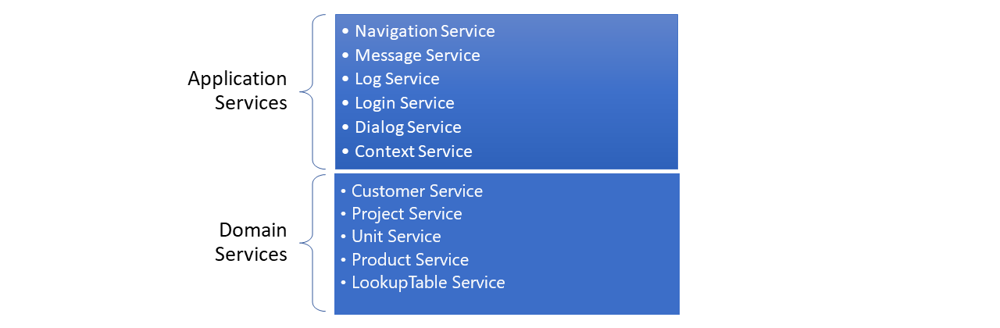
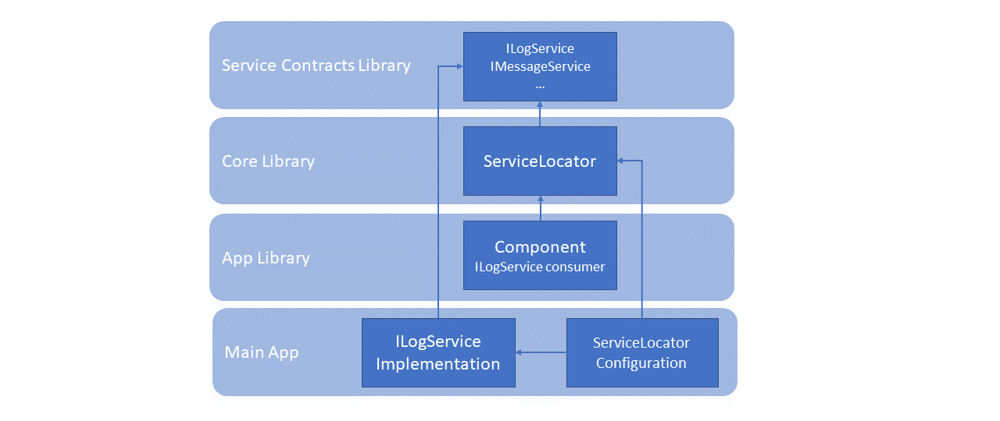

# AHPC CASS Software System

# Services
View-models make use of Services to execute the operations requested by the user, such as create, update or retrieve a list of customers or products. View-models also make use of Services to log the user activity, show dialogs or display a text in the status-bar by sending a message to the shell view.

Services contains the core functionality of the application. We distinguish two kinds of services:

-	**Application Services** – implement core functionality needed by the infrastructure of the application. This functionality in independent of the business of the application and can be reused in other solutions. Examples of application services are Navigation Service or Message Service that can be reused for any other application.
-	**Domain Services** (or Business Services) – implements the functionality specific for the business of the application. Examples of domain services are Customer Services or Product Services that are specific for a product management application.

The following diagram shows the two group of services used in this application:



## Application Services
Here is a brief description of the Application Services used in this application:

| Service                | Description |
|------------------------|-------------|
| **Navigation Service** | Expose the functionality to navigate back and forward to a different view. It also offers the possibility to open a view in a new window. |
| **Message Service** | Enables communication between different components of the application without having to know anything about each other. The communication between components are based on a publishers-subscribers pattern. |
| **Log Service** | Offers the methods to write logs to a local repository to keep track of the user activity for debugging or auditing purposes. |
| **Login Service** | Implements the authentication and authorization mechanism to access the application. |
| **Dialog Service** | Offers methods to display a dialog message to show information or ask for confirmation. |
| **Context Service** | Exposes properties and methods related to the current execution context. This service is used internally to manage the execution in a multi-window environment where each window is executed in a different thread. |

## Domain Services
The domain services in this application offer CRUD operations (Create, Read, Update, Delete) over the business entities. We have a specific service for Customers, Projects, Units and Products.

To see the common methods used in these services, let’s examine the Customer service:
-	**GetCustomer(id)** – get a single customer by its id.
-	**GetCustomers(request)** – get a collection of customers using the request parameter.
-	**GetCustomers(skip, take, request)** – same as GetCustomers(request) but returns only ‘take’ number of items starting from the ‘skip’ parameter.
-	**GetCustomersCount(request)** – return the number of Customers using the request parameter.
-	**UpdateCustomer(customer)** – update or create a new Customer with the values contained in the customer parameter.
-	**DeleteCustomer(customer)** – delete the Customer specified by the customer parameter.

There is also a LookupTables Service used to retrieve information for common Tables such as Categories or CountryCodes. This service is used, for example, to get the name of a country by its code, or the tax rate for a specific tax type.

# Services and Dependency Injection
When we need to make use of a service, the first thing we need is a reference to that service. The easiest way to get a reference to a service could be just creating an instance of the required service.

For example, let’s say we need to write a log using the Log Service:

```csharp
    var logService = new LogService();
    logService.Write(message);
```

Simple and straightforward, but this approach could lead to further problems:
1.	We are assuming that the Log Service is implemented in the scope of the current library, but this is not always the case. In this application, most of the services used by view-models are implemented in a different library not referenced by the view-models library.
2.	We are creating a new instance to write a log, but, shouldn’t it be better to reuse the same instance in all the application? The answer depends on several factors and may be subject to changes in the future. In any case, the decision on how to create an instance of a service should be taken outside the component that uses the service.
3.	On the other hand, creating a hard reference to a service is also a bad idea if we are planning to test our application. When testing a component, we will need a mechanism to replace one or more services by a fake implementation to trace and check if the component is working as expected.

To solve these and other issues that can arise by using hard references, we make use of the Dependency Injection pattern.

With Dependency Injection, we get an instance of a service by using a ServiceLocator.

> **Note:**
> The ServiceLocator implemented in this application is based on the .DependencyInjection.Abstractions package library.

To get an instance of a service using the ServiceLocator we can use the following code:

```csharp
    var logService = ServiceLocator.Request<ILogService>()
```

The first thing to note is that we are not creating an instance of a service, **we are requesting a service specifying an interface**.

This have the following considerations:
-	The ServiceLocator may return a new instance or reuse an existing instance of the service (singleton).
-	The ServiceLocator may return a real implementation of ILogService or a fake implementation for testing purposes.
-	Since we are requesting an interface, the service can be implemented in another library, out of the scope of the current component.

If the ServiceLocator returns a new instance, an existing instance, a real implementation or a fake implementation depends on the configuration of the service in the ServiceLocator. We will talk about the ServiceLocator configuration later.

The following diagram shows the relationship between components using a ServiceLocator.



As you can see in the diagram, the component consuming the ILogService can make use of the LogService, even when the service is implemented out of the scope of the component.

Dependency Injection is not only used to resolve Service instances, it is also used to request view-models and can be used for any object in the application. We just need to tell the ServiceLocator how to resolve the request.

## ServiceLocator configuration
We saw before how to request a service using the ServiceLocator. Now let’s see how to configure the ServiceLocator to return a specific instance when we request for a service.

The ServiceLocator uses a ServiceCollection class where services are registered and configured to be used in the application.

>**Note:** The ServiceCollection class is provided by the  DependencyInjection Library.

To register a service in the ServiceCollection we can use the following code:
```csharp
    serviceCollection.AddSingleton<ILogService, LogService>();
```

In this case, we are registering the ILogService interface to use the LogService implementation as a singleton. This means that the next time we request a ILogService, the ServiceLocator will return an instance of the LogService class and will reuse the same instance for all the future requests.

If we want the ServiceLocator to return a new instance for every request, we can register the ILogService as transient:
```csharp
    serviceCollection.AddTransient<ILogService, LogService>();
```

Registering a service as transient means that we always want a fresh new instance of the service implementation.

In this application, all services are configured as singleton, but there is an exception to this rule: The Navigation service.

The Navigation service is used to navigate to another view in the application. In a single window environment, the Navigation service can be reused by all components of the application, but in a multi-window environment, each window needs its own instance of the service.

To solve this scenario,  DependencyInjection Library introduces the concept of scopes and scoped services. We can see a scope as a context of execution. The following code configures a service as scoped.
```csharp
    serviceCollection.AddScoped<INavigationService, NavigationService>();
```

Scoped services are similar to singleton services but only when requested in the same scope. Requesting a scoped service in the same scope will return always the same instance but requesting a service in a different scope will return a different instance.

We, as developers, are responsible of creating a new scope when necessary. In this application, a new scope is created for each new window opened in the application. This way, when we request a INavigationService in one window we will receive a Navigation service to navigate in that window.

## Declaring dependencies in the constructor
When using the Dependency Injection pattern is very common to declare the required services in the constructor of the class.

For example, the Customer service depends on the ILogService and its constructor is declared as follows:

```csharp
    public CustomerService(ILogService logService)
    {
        LogService = logService;
    }

    private ILogService LogService { get; }
```

When we request a Customer service, the ServiceLocator examine the constructor and tries to resolve its dependencies. Since we did configure the ServiceLocator to resolve the ILogService, it will obtain the reference to the ILogService and pass it to the constructor of the Customer service.

Dependency Injection is not only used to resolve services, it is also used to resolve view-models and in general it could be used to resolve the instantiation of any class used in the application when required.

> **Note:**
> Only classes registered in the ServiceCollection can be resolved by using the ServiceLocator.

# Summary
Airhandlers CASS Sample architecture is designed following the MVVM pattern, separating the user interface from the business logic of the application.
-	Views represents the user interface of the application.
-	ViewModels contains the user interface logic.
-	Models represents the business data of the application.

View-models make use of services to execute the operation requested by the user. We distinguish two kinds of services:
-	Domain services – implement the business functionality of the application.
-	Application services – implement core functionality needed by the infrastructure of the application.

View-models and services are instantiated using a ServiceLocator following the Dependency Injection pattern.
-	We request a service to the ServiceLocator by specifying an interface.
-	ServiceLocator can be configured to instantiate services as Singleton, Transient or Scoped.
