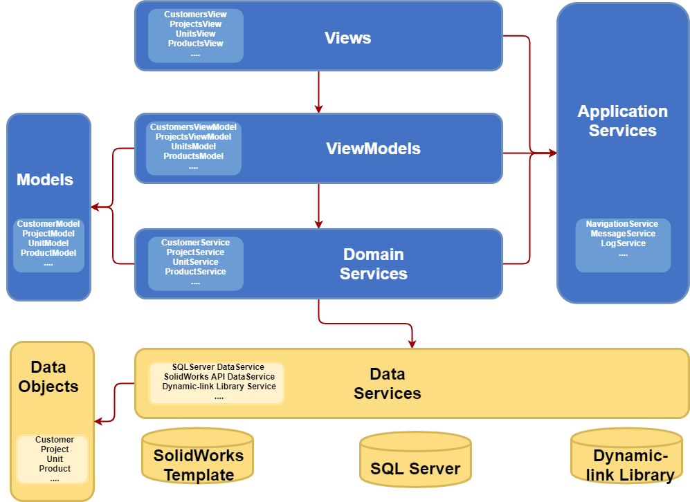

# Architecture Overview
**CASS Software System** is based on a VMMV architecture pattern to facilitate the separation of the user interface from the business logic of the application. You can read more details about the MVVM pattern in the MVVM section of this documentation.

The following diagram shows the different layers in the application.



# Views
Views are essentially what the user sees on the screen to interact with the application. Examples of Views in this application are: CustomersView, OrdersView or ProductsView.

Views contains layers and controls to display the user interface. The layers organize the controls in the view, and the controls show the information to the user. All views depend on a view-model that manage the logic of the User Interface.

When you examine the code-behind of a view, you will notice that the first thing it does in the constructor is instantiate the view-model. Another thing to notice is the overridden of two methods: OnNavigatedTo and OnNavigatingFrom.

The OnNavigatedTo is executed when the user navigates to this view and is used to initialize the view-model with the parameters received in the navigation.

The OnNavigatingFrom is executed when the user navigates out of this view and is used to free the resources used by the view-model.

The following code shows a typical implementation of a view.

```csharp
    public class CustomersView : Page
    {
        public CustomersView()
        {
            ViewModel = ServiceLocator.Current.GetService<CustomersViewModel>();
            InitializeComponent();
        }

        public CustomersViewModel ViewModel { get; }

        protected override async void OnNavigatedTo(NavigationEventArgs e)
        {
            ViewModel.Subscribe();
            await ViewModel.LoadAsync(e.Parameter as CustomerListArgs);
        }

        protected override void OnNavigatingFrom(NavigatingCancelEventArgs e)
        {
            ViewModel.Unload();
            ViewModel.Unsubscribe();
        }
    }
```

In order to simplify the development and make the code more readable, views are subdivided in subviews.

For example, the CustomersView consists on the following subviews:
-	**CustomersList** – contains the list of customers and the controls to execute common actions over the collection of customers, such as: Add new customer, search customers or refresh customer list.
-	**CustomersDetails** – contains the details of a selected customer with input controls to enable the edition of the selected customer in the list. It also contains the common actions available for a customer, such as: Edit or delete.
-	**CustomersCard** – shows the main properties of the selected customer as a quick and read only view.
-	**CustomersOrders** – contains the list of orders associated to the selected customer.
-	**CustomersView** – is the top-level view containing all the subviews described before.

The following image shows the diferent subviews contained in the CustomersView.


## Shell views
A Shell view is a special type of view. This view is the shell of a window and serves as a container for other views.

A Shell view contains a frame to enable the navigation between other views and a status bar on the bottom to notify messages to the user.

Anytime we open a new window in the application, a new Shell view is created, and the content is initialized using the frame to navigate to the specific view.

## MainShell view
The main window uses a specialized version of a Shell view: the MainShell view.

The MainShell view is like another Shell view but it contains a navigation pane on the left to offer the user different options to navigate to.

When you execute the application and log in, the MainShell view is created. There can be multiple Shell views in the application, but only one MainShell view.

The following image identifies the different elements in the MainShell view.


# ViewModels
View-models are another essential part in the MVVM architecture pattern. You can read more details about the concepts of the View-model in the MVVM – View Model section of this documentation.

The view-model contains the UI logic of the application, so it is reasonable to believe that there will be, at least, on view-model for each View. In some cases, where the view requires more complexity, more than one view-model are used for a single view.

To see how view-models are related to views, let’s see an example with the Customers view. The Customers view is associated with a Customers view-model and this view-model references two other view-models: CustomersList view-model and CustomersDetails view-model.

The following diagram shows this relationship.


## ViewModel hierarchy
Most of the properties and methods are common for all the different view-models so we use inheritance to reuse functionality.

The following diagram shows the view-models hierarchy.


### ObservableObject
The ObservableObject is the base class for all the objects that need to notify that a property has changed. This class contains a typical implementation of the INotifyPropertyChanged interface.

All view-model and model classes inherit from this object.

### ViewModelBase
This is the base class for all view-models in the application. It contains common members used by all view-models. It also contains a reference to the common services used by most of the view-models. These services are:
-	Navigation service
-	Message service
-	Dialog service
-	Log service
-	Context service

### GenericListViewModel
This is a generic class used by all the view-models that need to manage a list of elements. It contains common functionality used to query, select, add or delete elements from a data source. This functionality includes the following members:
-	Items – a generic list of items
-	ItemsCount – the number of items in the list
-	SelectedItem – the item currently selected
-	SelectedItems – list of items selected when in multi-selection mode
-	SelectedIndexRanges – list of range of items selected when using a virtual collection
-	Query – the text used to query and retrieve items from the data source
-	OnRefresh – abstract method executed to retrieve the list of items
-	OnNew – abstract method executed when the “New Item” command is invoked
-	OnDeleteSelection – abstract method to delete selected items

Please, refer to the GenericListViewModel source code for a detailed list of members implemented in this class.

### GenericDetailsViewModel
This is a generic class used by all the view-models that contains the details of a single item. It contains common functionality used to edit and delete an item. This functionality includes the following members:
-	Item – a generic item to be shown or modified
-	OnEdit – executed when the item edition starts
-	OnCancel – executed when the item edition is canceled
-	OnSave – executed when the item changes need to be saved
-	OnDelete – executed when the item is going to be deleted

Please, refer to the GenericDetailsViewModel source code for a detailed list of members implemented in this class.

# Models
Models are the third leg in the MVVM architecture pattern. You can read more details about the concepts of the Model in the MVVM – Models section of this documentation.

In this application, a model wraps the data of a business object to better expose its properties to the view. In other words, the business object is the raw data received from the data source while the Model is a “view friendly” version, adapting or extending its properties for a better representation of the data.

For example, the Customer business object contains the properties “Name” and “Last Name” and the CustomerModel expose also the property “FullName” as a concatenation of these two properties to be used in the Customer details view.

In a more complex scenario, the Customer business object contains only the “CountryCode” while the CustomerModel also expose the “CountryName” property updated from a lookup table if the “CountryCode” changes if, for instance, the user select a new country in a ComboBox control.

The Model also helps decouple the business objects used in the data layer from the classes used in the presentation layer, so if a change is required in a business object schema, the application will be less affected.

