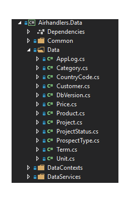

# Data Access

One of the most important parts of the application is how we access to the different Data Sources and how this logic is decoupled from the rest of the app.

We will review in detail the *Airhandlers.Data* project and how we use it in the application.

## Airhandlers.Data project

Since our *data source* is a relational database, we are using Entity Framework Core to manipulate the data and expose it.

We can split the project in three principal parts:

### Data

The *Data* folder contains all the data models, representing each table of the database:



These models will be our *Data Transfer Objects* or *DTOs* of our app.

### IDataSource

This interface represents the *database context*. We will have a class implementing `IDataSource` for each *context* representing a database.

```csharp
public interface IDataSource : IDisposable
{
    DbSet<CountryCode> CountryCodes { get; }
    DbSet<PaymentType> PaymentTypes { get; }
    DbSet<TaxType> TaxTypes { get; }
    DbSet<ProjectStatus> ProjectStatus { get; }
    DbSet<Shipper> Shippers { get; }

    DbSet<Customer> Customers { get; }
    DbSet<Project> Projects { get; }
    DbSet<Unit> Units { get; }
    DbSet<Product> Products { get; }

    EntityEntry<TEntity> Entry<TEntity>(TEntity entity) where TEntity : class;

    Task<int> SaveChangesAsync(CancellationToken cancellationToken = default(CancellationToken));
}
```
We can find two implementations of this interface: `SQLiteDb` and `SQLServerDb`, representing two different databases that will share the same logic to access, manipulate and expose the data.

### IDataService

The interface `IDataService` is used for access and manipulate data from the database.

```csharp
public interface IDataService : IDisposable
{
    Task<Customer> GetCustomerAsync(long id);
    Task<IList<Customer>> GetCustomersAsync(int skip, int take, DataRequest<Customer> request);
    Task<IList<Customer>> GetCustomerKeysAsync(int skip, int take, DataRequest<Customer> request);
    Task<int> GetCustomersCountAsync(DataRequest<Customer> request);
    Task<int> UpdateCustomerAsync(Customer customer);
    Task<int> DeleteCustomersAsync(params Customer[] customers);

    Task<Project> GetProjectAsync(long id);
    Task<IList<Project>> GetProjectsAsync(int skip, int take, DataRequest<Project> request);
    Task<IList<Project>> GetProjectKeysAsync(int skip, int take, DataRequest<Project> request);
    Task<int> GetProjectsCountAsync(DataRequest<Project> request);
    Task<int> UpdateProjectAsync(Project Project);
    Task<int> DeleteProjectsAsync(params Project[] Projects);

    Task<ProjectItem> GetProjectItemAsync(long ProjectID, int ProjectLine);
    Task<IList<ProjectItem>> GetUnitsAsync(int skip, int take, DataRequest<ProjectItem> request);
    Task<IList<ProjectItem>> GetProjectItemKeysAsync(int skip, int take, DataRequest<ProjectItem> request);
    Task<int> GetUnitsCountAsync(DataRequest<ProjectItem> request);
    Task<int> UpdateProjectItemAsync(ProjectItem ProjectItem);
    Task<int> DeleteUnitsAsync(params ProjectItem[] Units);

    Task<Product> GetProductAsync(string id);
    Task<IList<Product>> GetProductsAsync(int skip, int take, DataRequest<Product> request);
    Task<IList<Product>> GetProductKeysAsync(int skip, int take, DataRequest<Product> request);
    Task<int> GetProductsCountAsync(DataRequest<Product> request);
    Task<int> UpdateProductAsync(Product product);
    Task<int> DeleteProductsAsync(params Product[] products);


    Task<IList<Category>> GetCategoriesAsync();
    Task<IList<CountryCode>> GetCountryCodesAsync();
    Task<IList<ProjectStatus>> GetProjectStatusAsync();
    Task<IList<PaymentType>> GetPaymentTypesAsync();
    Task<IList<Shipper>> GetShippersAsync();
    Task<IList<TaxType>> GetTaxTypesAsync();
}
```

## Accessing the data from the app

### Data Service Factory

The first thing we have to define in the app, it's the source of the data we are going to consume. The interface `IDataServiceFactory` is the one responsable of provide the inplementation of `IDataService` that we use in the app. 
```csharp
public interface IDataServiceFactory
{
    IDataService CreateDataService();
}
```
The possible *data services* to be used in the app are: `SQLite` and `SQLServer`, and they are defined in the following enum class:
```csharp
public enum DataProviderType
{
    SQLite,
    SQLServer
}
```
To establish the Data Service to use, we just need to set the property `DataProvider` of the `AppSettings` class. By default, we are loading the `SQLite` data provider:
```csharp
public DataProviderType DataProvider
{
    get => (DataProviderType)GetSettingsValue("DataProvider", (int)DataProviderType.SQLite);
    set => LocalSettings.Values["DataProvider"] = (int)value;
}
```
With the data provider defined, we can review now how we are accessing to the data from our ViewModels.  

### Data Services

We have additional services, one per functionality of the app located in the *Services* folder inside the *Airhandlers.ViewModels* project:


Let's have a look a one of them:
```csharp
public interface ICustomerService
{
    Task<CustomerModel> GetCustomerAsync(long id);
    Task<IList<CustomerModel>> GetCustomersAsync(DataRequest<Customer> request);
    Task<IList<CustomerModel>> GetCustomersAsync(int skip, int take, DataRequest<Customer> request);
    Task<int> GetCustomersCountAsync(DataRequest<Customer> request);

    Task<int> UpdateCustomerAsync(CustomerModel model);

    Task<int> DeleteCustomerAsync(CustomerModel model);
    Task<int> DeleteCustomerRangeAsync(int index, int length, DataRequest<Customer> request);
}
```
This *contract* is offering us all the possible operations that we can do when we work with Customers.

Also, these services are not only accessing the data source, they are also acting as mappers between our DTOs and the Models that we used to represent the data visually. There are some advantajes in mapping our DTOs to *Models*:

- Not all the info of the DTO needs to be displayed in our views.
- DTOs should be normally simple classes with no behaviour defined in Project to facilitate serialization.
- The *Models* are the ones implementing the interface `INotifyPropertyChanged`, reducing complexity in our DTOs.

Let's check the inplementation of the `ICustomerService`:
```csharp
public class CustomerService : ICustomerService
{
    public CustomerService(IDataServiceFactory dataServiceFactory)
    {
        DataServiceFactory = dataServiceFactory;
    }

    public IDataServiceFactory DataServiceFactory { get; }

    public async Task<CustomerModel> GetCustomerAsync(long id)
    {
        using (var dataService = DataServiceFactory.CreateDataService())
        {
            var item = await dataService.GetCustomerAsync(id);
            if (item != null)
            {
                return await CreateCustomerModelAsync(item, includeAllFields: true);
            }
            return null;
        }
    }
}
```

As you can see, we are using the `IDataServiceFactory` to get the `IDataService` interface to consult a customer information.

Finally, we just need to check how we are injecting this `ICustomerService` in the `CustomerDetailViewModel` class to check how all the pieces are connected:

```csharp
public class CustomerDetailsViewModel : GenericDetailsViewModel<CustomerModel>
{
    public CustomerDetailsViewModel(ICustomerService customerService, ICommonServices commonServices) : base(commonServices)
    {
        CustomerService = customerService;
    }

    public ICustomerService CustomerService { get; }
}
```
